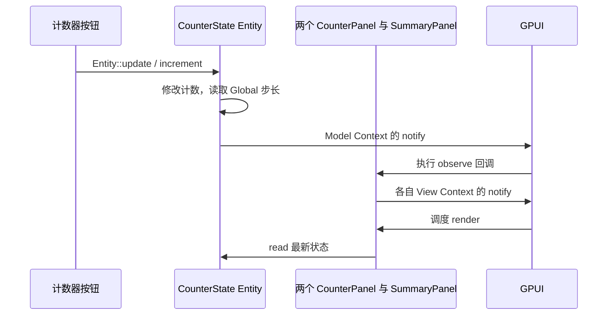

# GPUI 的订阅、通知与状态更新

本文对应当前项目的 `gpui-kit 0.6.4`，以及工作区锁定的 `gpui-pre 0.3.5`。
应用代码通过 `gpui_kit` 导入 API。以下示例基于当前计数器应用；标注为“扩展”的部分尚未加入业务代码。

## 1. 先区分三种机制

日常说的“订阅消息”，在 GPUI 中可以指不同的机制：

| 用途 | 如何订阅 | 如何触发 | 回调得到什么 |
| --- | --- | --- | --- |
| 观察某个 Entity 的状态变化 | `cx.observe(&entity, callback)` | 目标 Entity 的 `cx.notify()` | 目标 Entity 句柄；需要时自行读取新状态 |
| 接收某个 Entity 发出的具体事件 | `cx.subscribe(&entity, callback)` | 目标 Entity 的 `cx.emit(event)` | 目标 Entity 句柄和 `&Event` 数据 |
| 观察某个类型的 Global 变化 | `cx.observe_global::<T>(callback)` | `cx.set_global(...)` 或 `cx.update_global::<T, _>(...)` | 接收方上下文；通过 `cx.global::<T>()` 读取配置 |

**当前应用使用第一种和第三种，没有定义业务事件，也没有使用 `subscribe/emit`。**

`notify()` 表示“这个实体变了，请重新检查”，没有业务数据载荷。
`emit(event)` 表示“发生了这个具体事件”，可携带操作类型、结果或其他数据。
它们不会互相替代：`notify()` 不会发送自定义事件，`emit()` 也不等于刷新视图。

## 2. 当前应用有哪些状态

代码入口见 [main.rs](../src/main.rs)，状态定义见 [state.rs](../src/state.rs)。

| 对象 | 类型 | 存放内容或职责 |
| --- | --- | --- |
| 共享领域 Model | `Entity<CounterState>` | A/B 两个计数、最近操作说明 |
| 计数器 A/B | 两个 `Entity<CounterPanel>` | 各自的 CounterId、共享 Model 句柄、订阅句柄 |
| 汇总面板 | `Entity<SummaryPanel>` | 共享 Model 句柄、订阅句柄；从 Model 计算总数 |
| 父视图 | `Entity<CounterApp>` | 三个子视图 Entity、全局配置订阅 |
| 应用配置 | `AppSettings: Global` | 递增步长：1 或 5 |

Model 只是普通 Rust 结构体，不需要实现 `Render` 或额外的 Model trait。
视图也是 Entity，其状态类型实现了 `Render`。
当前 API 用 `cx.new()` 创建这两类实体，旧教程的 `new_model()` / `new_view()` 不适用于这里。

```rust
let model = cx.new(|_| CounterState::default());
let counter = cx.new(|cx| {
    CounterPanel::new(CounterId::A, model.clone(), cx)
});
```

`model.clone()` 复制的是句柄，多个句柄指向同一份 CounterState。
Global 则按类型存储在当前 App 内；它不是 Rust 的进程级 `static`。

## 3. Entity：如何订阅状态变化

在视图构造函数中订阅，并把返回的 Subscription 保存到视图中：

```rust
struct SummaryPanel {
    model: Entity<CounterState>,
    _subscription: Subscription,
}

impl SummaryPanel {
    fn new(model: Entity<CounterState>, cx: &mut Context<Self>) -> Self {
        let subscription = cx.observe(&model, |view, source, cx| {
            // view: &mut SummaryPanel，接收通知的视图。
            // source: Entity<CounterState>，发出通知的 Model。
            // cx: &mut Context<SummaryPanel>，属于接收方。
            // 当前应用在 render 中读取状态，所以这里只需请求刷新。
            let _ = (view, source);
            cx.notify();
        });
        Self { model, _subscription: subscription }
    }
}
```

实际代码不需要上述两个参数，因此写得更短：

```rust
let subscription = cx.observe(&model, |_, _, cx| cx.notify());
```

订阅后不会立即收到一份“初始状态”。视图第一次 render 时直接读取 Model：

```rust
let model = self.model.read(cx);
let total = model.total();
```

单独持有 Entity 或调用 `read()` 不等于建立这里的观察关系。
当前示例显式调用 `observe`，让 Model 的变化能够通知每个独立视图。

## 4. Entity：如何修改状态并通知视图

计数器按钮通过 `cx.listener` 取得当前视图，再进入共享 Model 的更新闭包：

```rust
.on_click(cx.listener(|view, _, _, cx| {
    view.model.update(cx, |model, cx| {
        model.increment(view.id, cx);
    });
}))
```

这里有两个不同的上下文：

| 位置 | `cx` 类型 | `cx.notify()` 指向谁 |
| --- | --- | --- |
| 外层按钮 listener | `Context<CounterPanel>` | 当前计数器视图 |
| 内层 Model update | `Context<CounterState>` | 共享 Model |
| Summary 的 observe 回调 | `Context<SummaryPanel>` | 汇总视图 |

Model 的方法负责修改数据，然后通知观察者：

```rust
pub fn increment(&mut self, id: CounterId, cx: &mut Context<Self>) {
    let step = cx.global::<AppSettings>().step();
    self.counts[id.index()] = self.count(id).saturating_add(step);
    self.last_change = format!(
        "Counter {} changed to {}", id.name(), self.count(id)
    );
    cx.notify();
}
```

`Entity::update` 提供可变访问，但不应把它当成自动通知机制。
此处由 `increment` 显式调用 `notify()`；以后添加修改方法时也应保留这一约定。

一次点击的完整过程：



三个视图观察的是整个 Model，所以点击 A 也会通知 B 和汇总面板。
这里没有自动的字段级依赖追踪。父视图没有观察 Model，不会收到这条显式通知。

重置也通过同一个 Model 完成：

```rust
view.model.update(cx, CounterState::reset);
```

`reset` 在一次 update 中修改两个计数，再调用 notify；观察者读取到的是完整的重置结果。

## 5. Global：如何初始化、订阅和更新

先定义一个应用配置类型：

```rust
pub struct AppSettings {
    step: usize,
}
impl Global for AppSettings {}
```

在应用启动、创建窗口之前初始化：

```rust
gpui_kit::init(cx);
cx.set_global(AppSettings::default());
```

Global 按类型查找，本例的 `global::<AppSettings>()` 要求配置已存在。
读取不会自动创建配置，也不会自动注册观察关系：

```rust
let step = cx.global::<AppSettings>().step();
```

需要随配置变化刷新的视图，在构造时订阅：

```rust
let subscription = cx.observe_global::<AppSettings>(|_, cx| {
    cx.notify(); // 这里仍然通知当前视图。
});
```

保存 Subscription 的要求与 Entity 观察相同。
当前两个 CounterPanel 和 CounterApp 都保存了这个订阅；SummaryPanel 没有订阅配置。

切换配置：

```rust
cx.update_global::<AppSettings, _>(|settings, _| {
    settings.toggle_step();
});
```

这会修改当前 App 中的配置，并安排对应 Global 的变化通知。
不需要额外调用 Model 的 notify，也不需要定义一个“配置已变化”的事件。

如果使用显式导入，`update_global` 所需的 trait 是：

```rust
use gpui_kit::BorrowAppContext;
```

切换步长后，父视图的步长说明和两个计数器按钮会更新。
已有计数不变，Summary 不会因这条 Global 通知而收到刷新请求。
下一次 increment 才读取新步长并修改领域数据。

## 6. 扩展：需要携带消息数据时使用 subscribe / emit

如果需要区分“计数变更”“保存完成”“请求失败”等具体事件，可以添加类型化事件。
下面是扩展示意，**当前代码并未加入这些定义或订阅**。

先声明事件数据和发送方支持的事件类型：

```rust
use gpui_kit::EventEmitter;

struct CounterChanged {
    id: CounterId,
    value: usize,
}

impl EventEmitter<CounterChanged> for CounterState {}
```

在 Model 的 `increment` 方法中，修改完成后发送事件：

```rust
cx.emit(CounterChanged { id, value: self.count(id) });
cx.notify(); // 若还需触发 observe，依然保留状态通知。
```

接收方的构造函数可以订阅：

```rust
let subscription = cx.subscribe(
    &model,
    |view, source, event: &CounterChanged, cx| {
        // view 是接收方，source 是发送方，cx 属于接收方。
        println!("Counter {} became {}", event.id.name(), event.value);
        let _ = (view, source);
        // 如果接收方的显示需要变化，再请求刷新。
        cx.notify();
    },
);
```

仍需将这个 subscription 存入接收方实体。
事件按“发送方 Entity + 事件类型”订阅，不是全局广播，也不会回放历史事件。

事件中的 value 是发出事件时明确记录的数据。回调中读取 `source.read(cx)` 得到的是处理回调时的状态；
如果已经发生了后续更新，两者可能不同。因此记录具体操作时使用事件载荷，展示当前总数时读取 Model。

只需刷新当前状态时使用 observe；确实需要业务事件信息时再使用 subscribe。
同一视图同时通过两种机制调用 notify，通常没有必要。

## 7. 生命周期与执行时序

**保存 Subscription。** 构造函数中只调用 observe 而不保存返回值，句柄会被丢弃，订阅随即取消。
当前代码用 `_subscription` / `_subscriptions` 字段保存它们；下划线仅表示不用直接读取字段，不影响持有关系。
视图销毁时订阅一起释放，不需要手动 unsubscribe。

**避免在 render 中订阅。** render 会反复执行。把 Entity 创建和订阅放在构造阶段，避免反复创建或累积订阅。

**不要为保活而随意 detach。** Subscription 的 detach 会放弃用该句柄控制取消的能力。
当前视图保存句柄，使其生命周期与视图一致。应用启动代码中的 `Task::detach()` 是任务 API，含义不同。

**update 同步，通知与渲染不应当作同步调用。** update 闭包返回时数据已经修改；
不要假设 notify / emit 返回时所有观察回调和 render 都已执行。
多次 notify 可能合并处理，不要用观察回调次数统计业务操作次数，也不要把回调当作状态快照日志。

**Global 观察的注册也有调度过程。** 当前实现中 observe_global 的激活会延后到 App 更新流程。
先初始化 Global、构造视图并注册观察，之后由用户交互更新，是本例采用的顺序。
不要依赖注册后在同一构造调用栈内立刻修改 Global 就必然触发新观察者。

**不要递归更新正在借用的 Entity。** 已处于 Model 的 update 闭包时，直接使用闭包给出的 `&mut Model`。
避免再次通过句柄 update 同一个 Model，也避免观察回调互相写回造成通知循环。

**Entity 句柄有所有权。** 三个子视图强引用同一个 Model，Model 不反向强引用视图。
原生观察回调使用接收方的弱句柄。最后一个强句柄释放后，GPUI 在更新/清理流程中释放实体。
自定义闭包仍需避免自行捕获强句柄形成引用环。

## 8. 如何验证

运行当前测试：

```sh
cargo test -p entity_view_example
```

[tests.rs](../src/tests.rs) 覆盖：

1. 同步修改共享 Model 后，计数与总数正确，三个子视图均收到通知；重置同样有效。
2. 更新 Global 后，仅配置消费者收到对应通知；计数不被配置更新直接改变，后续递增使用新步长。
3. 视图持有 Model；释放视图并完成 App 清理后，订阅不会把 Model 留住。

测试在检查通知前调用 `cx.run_until_parked()`，让 GPUI 处理待执行工作。
实体释放测试在 App 更新周期中丢弃父视图，让清理流程执行。
这些是无窗口状态与通知测试，不等于验证了实际屏幕上的渲染效果。

## 9. 排查不更新的问题

| 现象 | 优先检查 |
| --- | --- |
| 数据已修改，视图没变化 | Model 方法是否 notify；视图是否 observe；回调是否通知了视图 |
| 订阅回调一次也没触发 | Subscription 是否被保存；是否订阅了正确的实体和事件类型 |
| Global 显示不更新 | 是否 observe_global 并保存句柄；是否通过 update_global 修改 |
| notify 后 subscribe 回调没执行 | 两套 API 不互通；自定义事件需要 emit |
| emit 后 observe 回调没执行 | 若状态也改变，应另外 notify |
| 更新后立即断言回调结果失败 | 数据更新同步不代表回调同步，测试需推进 GPUI 调度 |
| 初始化读取 Global 失败 | 是否在创建视图前 set_global |
| 重复回调或通知循环 | 是否在 render 中注册订阅，或在观察回调中无条件修改被观察对象 |

API 行为核对依据为当前依赖源码中的 `app/context.rs`（observe / subscribe / observe_global）
以及 `gpui.rs`（EventEmitter / BorrowAppContext），示例行为由本项目测试覆盖。
