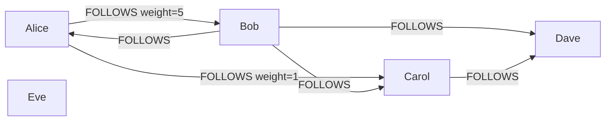
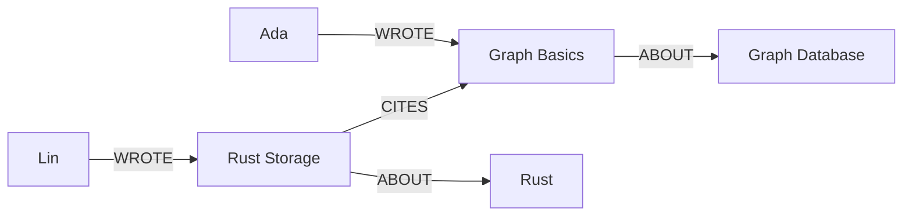
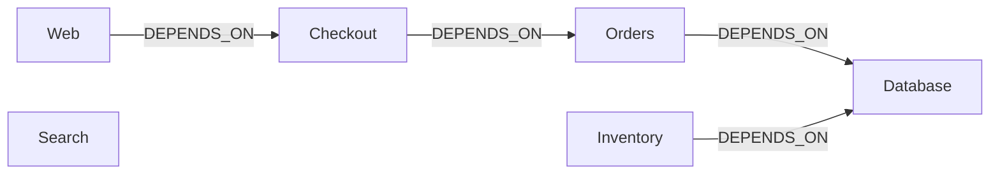

# HelixDB 作为图数据库的作用

图数据库把业务对象存成**节点**，把对象间的联系存成带方向和类型的**边**。节点和边都可以有属性。例如 `Alice -[FOLLOWS {weight: 5}]-> Bob`：两个人是节点，关注是关系，互动权重属于这条关系。

本项目的图案例使用 HelixDB 的 Rust DSL 构造查询，通过嵌入式引擎执行。每次运行创建独立内存数据库，先在一个 write batch 中创建节点和边，再执行 read batch。数据不会写入已有 `data/`。

## 运行方式

```bash
cargo run -p helix_embedded_example -- graph-all
# 或单独运行
cargo run -p helix_embedded_example -- social
cargo run -p helix_embedded_example -- recommendation
cargo run -p helix_embedded_example -- knowledge
cargo run -p helix_embedded_example -- dependencies
```

源码位于 `src/graph_examples.rs`。输出包含实际查询结果；结果错误会以非零状态退出。校验忽略行顺序，但保留重复行，因此也能检查去重是否正确。

2026-10-01 验证：离线构建通过，`graph-all` 的四个案例、共八次查询结果校验全部通过，包括删除依赖关系后的再次查询。

| 案例 | 业务问题 | 体现的图能力 |
| --- | --- | --- |
| social | 关注的人又关注了谁？哪些关系互动较强？ | 二跳遍历、集合排除、去重、边属性过滤 |
| recommendation | 买过相同商品的人还买了什么？ | 正向和反向遍历、跨节点类型关联 |
| knowledge | 某主题有哪些文章，由谁撰写？谁引用了它？ | 多种关系、关联投影、信息来源追踪 |
| dependencies | 数据库故障会影响哪些服务？解除依赖后呢？ | 有界递归、反向影响分析、关系删除 |

## 1. 社交网络：发现二跳联系人



- Alice 直接关注的人：Bob、Carol。
- 两跳遍历会遇到 Dave、Alice、Carol；Dave 可以通过两条路径到达。
- 排除 Alice 自己、已有关注集合并去重后，只返回 Dave。孤立节点 Eve 不会被推荐。
- 对 Alice 的关注边筛选 `weight >= 3`，得到一条 `weight=5` 的关系。

核心遍历：

```rust
g().n(NodeRef::var("following"))
  .out(Some("FOLLOWS"))
  .without("me")
  .without("following")
  .dedup()
  .value_map(Some(vec!["name"]))
```

这里 `following` 和 `me` 来自同一个 read batch 中前面的命名查询。FOLLOWS 是有向关注，并不自动表示双方互为好友。通过 `out_e` 查询边本身，可以过滤关系属性，而不仅是人的属性。

## 2. 共同购买：通过关系生成推荐候选

Alice 买了 Rust Book；Bob 买了 Rust Book 和 Keyboard；Carol 买了 Rust Book、Keyboard 和 Mouse。Camera 没有人购买。

遍历路径是：

```text
Alice --BOUGHT--> Rust Book <--BOUGHT-- Bob/Carol --BOUGHT--> 商品
```

查询用 `out("BOUGHT")` 找已购商品，用 `in_("BOUGHT")` 找买过它们的人，再用 `out("BOUGHT")` 找这些人的商品。排除 Alice 自己和已购商品、去重后，返回 Keyboard、Mouse，不会返回 Rust Book 或无关联的 Camera。

这是基于共同购买关系生成的候选集合，不包含评分、排序或机器学习模型。图数据库在这里的作用是把“人—商品—人—商品”的关系路径直接表达成查询；之后可以再增加销量、时间或共同购买人数等排序依据。

## 3. 知识图谱：主题、文章、作者和引用



从 Graph Database 主题反向遍历 ABOUT，找到 Graph Basics；再反向遍历 WROTE，找到 Ada。使用 `bind("article")` 保存途经文章，`project_bindings` 将文章和作者返回在同一行：

```json
{"result":[{"article":"Graph Basics","author":"Ada"}]}
```

反向遍历 CITES 则找到引用这篇文章的 Rust Storage。这里的关系来自明确写入的事实，并非引擎自动推断。类似模型可以支持文档关联和 RAG 的来源追踪；本案例没有调用大模型或向量检索。

## 4. 依赖分析：故障的传播范围



边从依赖者指向被依赖者，因此从 Database 出发沿 `in_("DEPENDS_ON")` 反向遍历，可以找到可能受其故障影响的服务。

```rust
.repeat(
  RepeatConfig::new(sub().in_(Some("DEPENDS_ON")))
    .emit_after()
    .max_depth(3)
)
```

`emit_after()` 收集每轮到达的节点，而不仅是最后一层；最多三跳，结果是 Orders、Inventory、Checkout、Web，Search 不在其中。删除 `Orders -> Database` 关系后，再执行同一查询，只返回 Inventory；服务节点仍然存在。

这演示的是图上可达关系代表的潜在影响，实际故障还取决于降级、冗余和运行状态。三跳限制只覆盖本案例的深度，不能当作任意规模依赖图的完整影响范围；遇到环时也应保留深度上限，并根据业务决定去重及路径策略。

## 如何选用这些能力

如果问题经常是“与它有关的对象有哪些”“经过几层关系能到哪里”“这条结论来自哪个实体”，节点和边能使数据模型与问题保持一致。关系数据库也能通过 JOIN 或递归查询解决这些问题；这里展示的是图建模和遍历的表达方式，没有做两类数据库的性能对比。

案例中的按标签及 name 查找是小数据集教学写法；生产系统还应根据访问模式设计属性索引、限定遍历范围，并只返回需要的字段。HelixDB 也支持向量和全文检索，但它们不是这些图查询运行的前提。

参考：本地上游文档 `docs/upstream/traversals.mdx`、`writing-data.mdx`、`advanced.mdx`（来源及许可证见该目录 README）。
